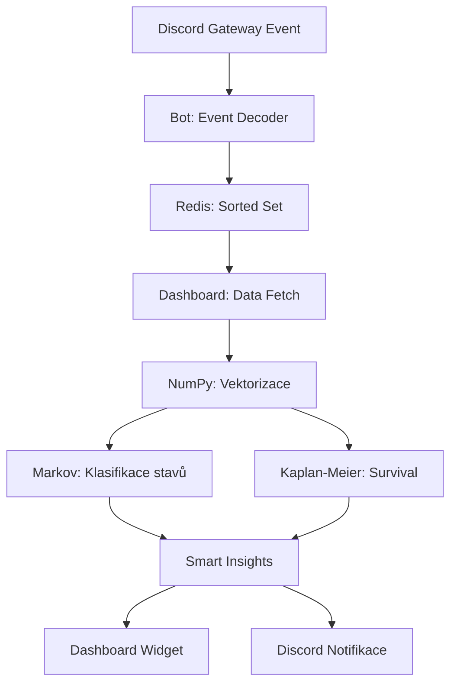
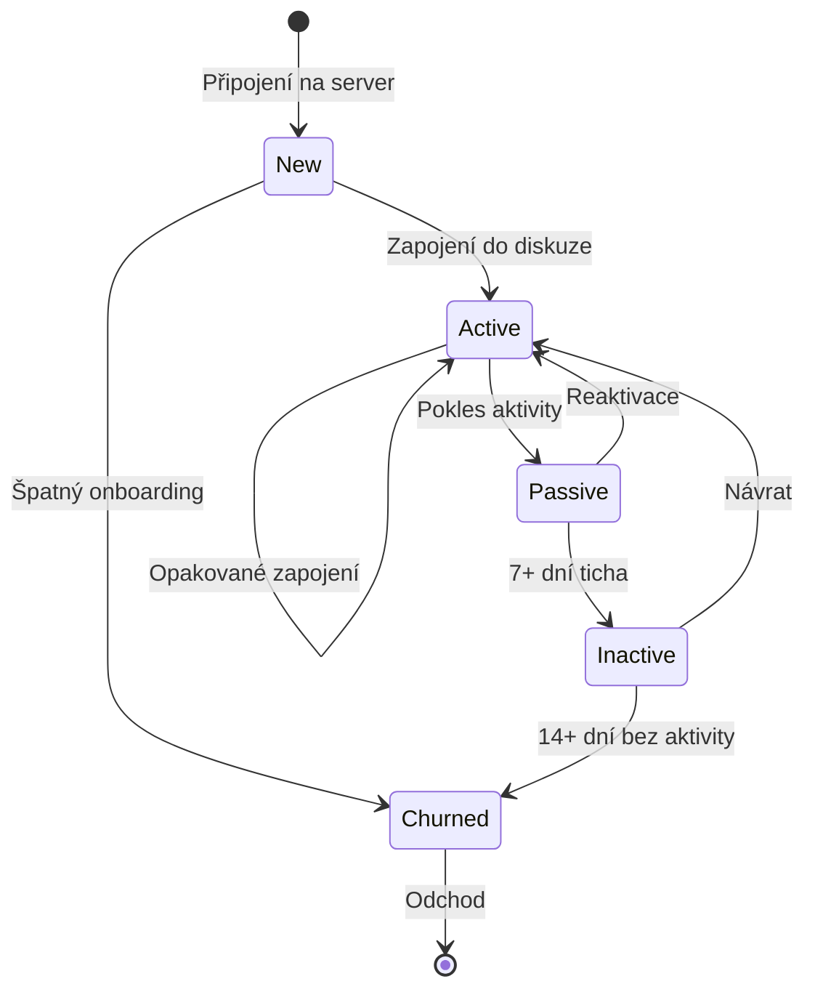

# Přehled predikce

Přehled prediktivních schopností systému Metricord - od klasifikace uživatelů po automatická doporučení pro moderátory.

## Datový tok

## Klasifikace uživatelů

Systém rozděluje uživatele do 5 stavů podle aktivity za posledních 7 dní. Stav se přehodnocuje každou hodinu.

| Stav | Index | Kritérium | Typická akce moderátora |
| :--- | :--- | :--- | :--- |
| New | $S_0$ | Na serveru < 24 hodin. | Uvítání, onboarding. |
| Active | $S_1$ | Aktivita v posledních 7 dnech. | Udržování zapojení. |
| Passive | $S_2$ | Poslední aktivita před 3–7 dny. | Přímé oslovení, zmínka v diskuzi. |
| Inactive | $S_3$ | Poslední aktivita před 7–14 dny. | Osobní zpráva s pozvánkou. |
| Churned | $S_4$ | Žádná aktivita > 14 dní. | Analýza příčiny pro budoucí prevenci. |

### Přechodový diagram

## Markovovy řetězce

### Princip

Systém modeluje komunitu jako diskrétní Markovův řetězec s 5 stavy. Pro každou dvojici stavů $(i, j)$ odhaduje pravděpodobnost přechodu $P_{ij}$ z empirických dat za posledních 30 dní.

### Matice přechodu (příklad)

|  | New | Active | Passive | Inactive | Churned |
| :--- | :--- | :--- | :--- | :--- | :--- |
| **New** | 0,10 | 0,60 | 0,15 | 0,05 | 0,10 |
| **Active** | 0,00 | 0,85 | 0,10 | 0,04 | 0,01 |
| **Passive** | 0,00 | 0,30 | 0,40 | 0,20 | 0,10 |
| **Inactive** | 0,00 | 0,05 | 0,15 | 0,50 | 0,30 |
| **Churned** | 0,00 | 0,00 | 0,00 | 0,00 | 1,00 |

Interpretace: uživatel ve stavu Active má 85% pravděpodobnost, že zůstane aktivní, 10% že přejde do Passive a 4% do Inactive.

### Predikce na 7 dní

Aktuální rozložení komunity $\mathbf{v}_0$ se vynásobí sedmou mocninou matice přechodu:

$$\mathbf{v}_7 = \mathbf{v}_0 \cdot P^7$$

Dashboard zobrazuje srovnání aktuálního a predikovaného rozložení ve sloupcovém grafu.

## Kaplan-Meierova survival analýza

### Princip

Estimátor $\hat{S}(t)$ udává pravděpodobnost, že uživatel zůstane na serveru alespoň $t$ dní po připojení:

$$\hat{S}(t) = \prod_{i: t_i \le t} \left(1 - \frac{d_i}{n_i}\right)$$

kde:
- $d_i$ je počet odchodů v čase $t_i$,
- $n_i$ je počet uživatelů „na riziku" v čase $t_i$ (dosud neodešli ani nejsou cenzorováni).

### Cenzorovaná data

Uživatelé, kteří jsou stále aktivní, nejsou z analýzy vyloučeni, ale označeni jako cenzorovaní (`event_observed = False`). To zvyšuje přesnost odhadu oproti jednoduchému průměru.

### Interpretace křivky

- **Prudký pokles po 1–3 dnech** - špatný onboarding. Řešení: vylepšení uvítacího procesu.
- **Pozvolný pokles** - přirozená fluktuace. Zdravý stav.
- **Plateau po 30+ dnech** - stabilní jádro komunity. Uživatelé, kteří přežijí první měsíc, zůstávají dlouhodobě.

### Střední délka setrvání

Z křivky přežití se vypočítá střední délka setrvání jako plocha pod křivkou (viz [matematické základy](/math-foundations)):

$$E[T] \approx \sum_{i} \hat{S}(t_i) \cdot \Delta t_i$$

## Confidence Score

Každá predikce má skóre spolehlivosti (0–1,0):

| Rozsah | Klasifikace | Podmínka |
| :--- | :--- | :--- |
| > 0,8 | Vysoká | Historie > 30 dní, > 100 aktivních uživatelů. |
| 0,5–0,8 | Střední | Historie 7–30 dní. |
| < 0,5 | Nízká | Historie < 7 dní. Predikce zobrazeny s označením „experimentální". |

Spolehlivost roste s objemem dat. Po [backfillu](/backfill) historických zpráv se confidence score zvýší okamžitě.

## Cyklus přetrénování modelů

| Typ | Interval | Popis |
| :--- | :--- | :--- |
| Inkrementální update | Každou hodinu | Přidání nových přechodů do matice. |
| Plný retraining | Každých 24 hodin (3:00 UTC) | Přepočet celé matice z 30denní historie. |

## MII (Moderator Intervention Index)

Poměr moderátorských zásahů k celkovému objemu zpráv. Slouží jako nepřímá metrika toxicity:

$$MII = \frac{\text{váž. moderátorské akce}}{\text{celkový počet zpráv}} \times 1000$$

| MII | Engagement Score | Interpretace |
| :--- | :--- | :--- |
| Nízký | Nízký | Nízká aktivita i zásahy. |
| Nízký | Vysoký | Ideální stav - aktivní komunita bez konfliktů. |
| Vysoký | Vysoký | Aktivní, ale konfliktní - posilte pravidla. |
| Vysoký | Nízký | Toxické prostředí odrazuje nové členy. |

### Trendy MII

Pokud MII roste při konstantní aktivitě, systém generuje Smart Insight s doporučením:
- Kontrola pravidel serveru.
- Zvýšení počtu moderátorů.
- Analýza problémových kanálů nebo časových oken.
