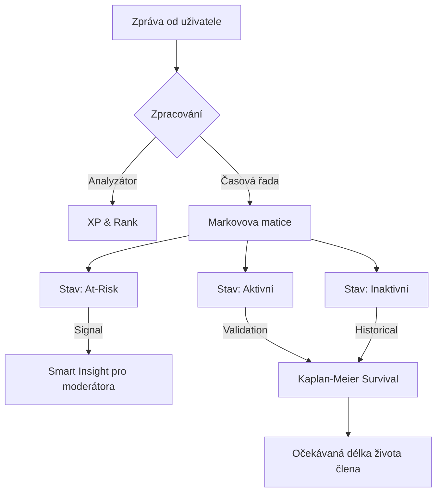

# Predikce a Machine Learning

Metricord využívá pokročilý statistický aparát k pochopení dynamiky komunit. V této sekci vysvětlujeme, jak naše modely pracují s vašimi daty a co přesně znamenají jejich výstupy.

## 1. Technické detaily predikce

### Markovovy řetězce (Transition Layers)
Systém rozděluje uživatele do stavů podle jejich aktivity v posledních 7 dnech. Pravděpodobnost přechodu ze stavu *Aktivní* do *Inaktivní* je klíčovým indikátorem zdraví serveru. Pokud matice ukazuje náhlý posun pravděpodobností směrem k inaktivitě, systém vyhodnotí varování.

### Kaplan-Meierův odhad
Používáme k výpočtu "Survival rate" komunity. Pomáhá nám zodpovědět otázku: *"Pokud uživatel zůstane 30 dní, jaká je pravděpodobnost, že zůstane i příští měsíc?"*

## 2. Interpretace Confidence Scores

Každá predikce v Metricord je doprovázena **Skóre spolehlivosti** (0–1.0).
- **High (> 0.8):** Velmi spolehlivé. Doporučujeme akci moderátora.
- **Medium (0.5 - 0.8):** Indikativní. Sledujte uživatele.
- **Low (< 0.5):** Experimentální / málo dat.

## 3. Cyklus učení modelů (Retraining)

- **Incremental Updates:** Každou hodinu.
- **Full Retraining:** Každých 24 hodin (obvykle ve 3:00 ráno).

::: info
Čím delší historii dat (Backfill) máte, tím přesnější jsou dlouhodobé predikce odchodu (Churn).
:::

## 4. Matice přechodu (Příklad)

| Z / DO | Aktivní | Riziko | Inaktivní | Churn |
| :--- | :--- | :--- | :--- | :--- |
| **Aktivní** | 0.85 | 0.10 | 0.04 | 0.01 |
| **Riziko** | 0.30 | 0.40 | 0.20 | 0.10 |
| **Inaktivní** | 0.05 | 0.15 | 0.50 | 0.30 |

Z tabulky je patrné, že uživatel v "Riziku" má stále 30% šanci se vrátit k plné aktivitě při zásahu moderátora.

## 5. Toxicity Index (MII)

**Moderator Intervention Index (MII):** Poměr moderátorských zásahů k celkovému objemu zpráv.
- **Predikce konfliktů:** Pokud MII začne růst při stejné aktivitě, blíží se k "Drama".
- **Doporučení týmu:** Algoritmus navrhuje, zda potřebujete více moderátorů.
