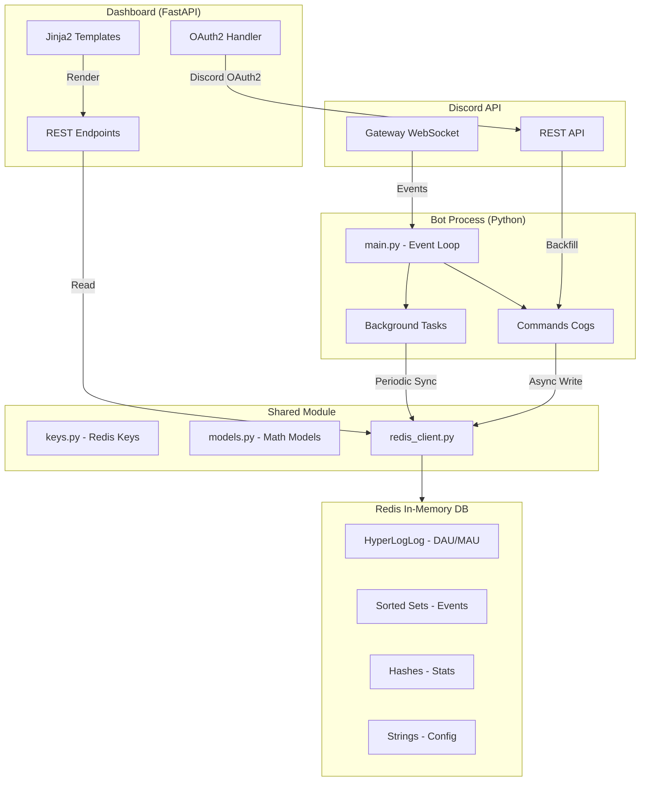

# Architektura systému

Metricord je distribuovaný systém navržený pro zpracování milionů událostí v reálném čase. Tato stránka podrobně popisuje všechny komponenty, jejich komunikaci a datový tok.

## 1. High-level přehled



## 2. Technický stack

| Komponenta | Technologie | Účel |
| :--- | :--- | :--- |
| **Bot Engine** | Python 3.9+, discord.py 2.6 | Asynchronní zpracování Discord událostí, command handling |
| **Dashboard Backend** | FastAPI, Uvicorn | High-performance REST API, SSR |
| **Dashboard Frontend** | VitePress, Chart.js, Vanilla CSS | Responzivní UI, interaktivní grafy, moderní dokumentace |
| **Datové úložiště** | Redis / Valkey | In-memory databáze pro real-time analytiku, sub-ms latence |
| **Matematické modely** | NumPy | Markovovy řetězce, Kaplan-Meier, lineární regrese |
| **Autentizace** | Discord OAuth2, itsdangerous | Bezpečné přihlašování, session management |
| **Kontejnerizace** | Docker, Docker Compose | Izolace služeb, produkční nasazení |

## 3. Adresářová struktura projektu

```text
metricord/
├── bot/
│   ├── main.py              # Entry point, event loop, background tasks
│   └── commands/
│       ├── activity.py      # Hlavní tracking modul - XP, voice, zprávy
│       ├── stats_hll.py     # HyperLogLog statistiky - DAU/MAU
│       ├── gdpr.py          # GDPR příkazy - export, smazání dat
│       ├── health.py        # Zdravotní check - Redis ping, bot status
│       └── analytics_tracking.py  # Event tracking pro dashboard
├── web/
│   ├── backend/
│   │   ├── main.py          # FastAPI routes - Dashboard API
│   │   ├── utils.py         # Analytické výpočty - Engagement, predikce
│   │   └── hydrate_users.py # Synchronizace uživatelských dat
│   └── docs-site/           # Tato dokumentace (VitePress)
├── shared/
│   ├── keys.py              # Redis klíčová schéma
│   ├── models.py            # Matematické modely - Markov, Kaplan-Meier
│   └── redis_client.py      # Singleton Redis klient
└── config/                  # Konfigurace a tajemství
```

## 4. Detailní datový tok (Event-Driven Flow)

Metricord využívá plně asynchronní architekturu postavenou na `asyncio`.

::: info A. Ingesce (Bot Layer)
Discord Gateway pošle JSON událost (např. `MESSAGE_CREATE`). Bot ji dekóduje a okamžitě předává do `ActivityTracker`. Zde se provádí *Deduplikace* (zabránění započítání stejné zprávy dvakrát).
:::

::: info B. Zpracování & Skórování
Vypočítá se základní XP. Pokud zpráva obsahuje více než 50 znaků, aplikuje se `Length-Based Bonus`. Pokud uživatel napsal zprávu před méně než 60 sekundami (konfigurovatelné), body se nepřičtou (Cooldown), ale událost se započítá do DAU/MAU statistik.
:::

::: info C. Persistence (Redis Pipeline)
Pro minimalizaci latence bot používá Redis Pipeline:
```text
PIPELINE:
  PFADD hll:dau:{gid}:{date} {uid}
  HINCRBY stats:hourly:{gid}:{date} {hour} 1
  ZADD events:msg:{gid}:{uid} {now} {now}
  EXPIRE events:msg:{gid}:{uid} 2592000 (30 dní)
```
:::

## 5. Redis Schéma - Deep Dive

Metricord využívá pokročilé datové struktury Redis pro maximální efektivitu.

**HyperLogLog (HLL):**
Umožňuje sledovat unikátní uživatele (DAU/MAU) s fixní paměťovou náročností 12 KB bez ohledu na počet členů (i miliony). Chyba odhadu je pouze 0.81%.

| Struktura | Klíč (Shared Keys) | Použití |
| :--- | :--- | :--- |
| **Sorted Set (ZSET)** | `events:msg:{gid}:{uid}` | Score = Timestamp. Umožňuje `ZRANGEBYSCORE` pro analýzu churnu. |
| **Hash (HASH)** | `stats:heatmap:{gid}` | Agregovaná aktivita pro heatmapu. |
| **Set (SET)** | `bot:guilds` | Globální seznam aktivních serverů. |

## 6. Background Workers & Microservices

Projekt je rozdělen do několika izolovaných procesů:
- **Bot-Primary:** Sběr událostí z Discord Gateway.
- **Bot-Dashboard-Syncer:** Synchronizace rolí a metadat v intervalu 1 hodina.
- **FastAPI Backend:** Čtení dat z Redisu a provádí matematické transformace on-the-fly.

::: tip Optimalizace výkonu
Náročné maticové operace pro Markovovy řetězce jsou prováděny pomocí `NumPy` v C-extension, což je o 2 řády rychlejší než čistý Python.
:::

## 6. Životní cyklus události (Pipeline Step-by-Step)

Každá zpráva na Discordu projde následujícím řetězcem zpracování:

1.  **Ingesce:** Gateway WebSocket bota přijme událost `GUILD_CREATE_MESSAGE`.
2.  **Validace:** Bot ověří, zda zpráva nepochází od jiného bota a zda má Metricord přístup k obsahu zprávy (Message Intent).
3.  **Extrakce metadat:** Získá se `user_id`, `guild_id`, timestamp a délka zprávy.
4.  **Asynchronní zápis:** Bot odešle data do Redis pipeline. Akce nezamyká hlavní vlákno bota, což zajišťuje plynulý chod.
5.  **HyperLogLog Sync:** ID uživatele se započítá do denní HLL struktury pro sledování DAU.
6.  **Výpočet XP:** Bot vypočítá XP na základě délky zprávy a cooldownu. Pokud je vše v pořádku, inkrementuje XP v Redis Hashi daného uživatele.
7.  **Zobrazení:** Dashboard při dalším načtení vytáhne čerstvá data z Redisu, provede transformaci pomocí NumPy a vykreslí aktualizované grafy.

## 7. Škálovatelnost a Vysoká dostupnost (HA)

Metricord je navržen tak, aby dokázal obsloužit desetitisíce Discord serverů současně.

### A. Horizontální škálování botů (Sharding)
Discord API omezuje jeden WebSocket na cca 2500 serverů. Metricord implementuje **Discord Sharding**, kde lze spustit více instancí bota, přičemž každá instance zpracovává pouze svou část (shard) celkového provozu. Díky Redisu jako centrálnímu úložišti sdílejí všechny shardy stejná data.

### B. Redis Cluster & Sentinel
Pro kritické nasazení podporuje Metricord:
- **Redis Sentinel:** Zajišťuje automatický failover. Pokud hlavní Redis selže, Sentinel automaticky povýší repliku na mastera a bot se k němu během několika sekund připojí.
- **Redis Cluster:** Umožňuje horizontální dělení dat (Sharding) napříč více servery, což eliminuje omezení paměti RAM na jediném stroji a zvyšuje výkon zápisu.

### C. Nginx jako Load Balancer
V produkčním prostředí běží FastAPI backend za proxy serverem Nginx. Nginx zajišťuje:
- **SSL Termination:** Šifrování HTTPS komunikace směrem k uživateli.
- **VitePress Caching:** Rychlé servírování statické dokumentace bez zatěžování backendu.
- **Load Balancing:** Rozdělování požadavků mezi více instancí FastAPI běžících v Docker kontejnerech.
