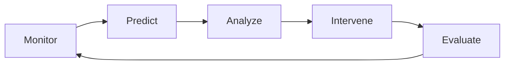

# Případové studie (Analýza v praxi)

Konkrétní scénáře, jak využít data z Metricord k řešení reálných problémů na vašem serveru.

::: info Scénář A: Záchrana odcházející "elity"
**Problém:** Majitel serveru si všiml, že nejaktivnější členové (Level 20+) začínají být méně aktivní. Existuje riziko "dominového efektu" odchodu komunity.

**Řešení s Metricord:**
1. **Identifikace:** V sekci *Predikce* vyfiltrujte uživatele s vysokým *Churn Risk* (>70 %), kteří mají zároveň vysoké celkové XP.
2. **Analýza:** Model *Kaplan-Meier* ukázal, že tito uživatelé obvykle odcházejí po 6 měsících.
3. **Akce:** Vytvoření speciálního private kanálu pro tyto "veterány" a zavedení nového systému odměn (Achievements) pro Level 30+.

**Výsledek:** Churn Risk u klíčové skupiny klesl o 45 % během prvního měsíce.
:::

::: danger Scénář B: Detekce "Tichého raidu"
**Problém:** Na server přišlo 200 lidí během noci. Nejsou agresivní, ale spamují nesmyslné krátké zprávy, aby "přebili" skutečnou konverzaci.

**Řešení s Metricord:**
1. **Detekce:** *Smart Insights* nahlásily anomálii v *Average Message Length* (pokles ze 45 na 8 znaků).
2. **Verifikace:** *Velocity Stats* ukazují 120 zpráv/min, ale *DQS Index* je nízký.
3. **Akce:** Dočasné zpřísnění XP vah pro krátké zprávy a zapnutí 2FA verifikace pro nové členy.

**Výsledek:** Spamery to přestalo bavit, protože nezískávali úrovně, a po 2 dnech server opustili.
:::

::: tip Scénář C: Výběr ideálního času pro event
**Problém:** Komunitní kvíz má malou účast, přestože je na serveru 5000 lidí.

**Řešení s Metricord:**
1. **Analýza:** *Heatmapa aktivity* ukázala, že špička počtu zpráv je v 20:00, ale špička *Voice aktivity* je až ve 22:30.
2. **Korelace:** Lidé v 20:00 jen "píšou u jídla", ale u PC a připraveni na Voice jsou až později.
3. **Akce:** Přesun kvízu z 20:00 na 22:15.

**Výsledek:** Účast na eventu vzrostla o 150 %.
:::

::: warning Scénář D: Obnova po výpadku Redis (Disaster Recovery)
**Problém:** Server se restartoval po hardwarovém výpadku. Redis ztratil data z posledních 4 hodin, protože běžel pouze s RDB snapshotami v 15minutových intervalech.

**Řešení s Metricord:**
1. **Diagnostika:** Příkaz `redis-cli DBSIZE` ukázal nižší počet klíčů, než odpovídá normálu. `bot:heartbeat` chybí.
2. **Obnovení:** Načtení posledního zálohy `dump.rdb` z adresáře `/backup/`:
   ```bash
   sudo systemctl stop redis
   cp /backup/metricord-20260413.rdb /var/lib/redis/dump.rdb
   sudo systemctl start redis
   ```
3. **Doplnění:** Spuštění `/activity backfill days:1` pro dopočítání chybějících 4 hodin z Discord API.
4. **Prevence:** Přechod z čistého RDB na kombinaci **RDB + AOF** dle [doporučení v deployment](/deployment#_10-strategie-disaster-recovery).

**Výsledek:** Ztráta dat omezena na max. 15 minut (poslední RDB snapshot). Po backfillu kompletní data.
:::

## 4. Metodika aplikované analytiky

Při řešení scénářů postupujte podle cyklu **Metricord Analytics Loop**:

1. **Monitor (Sledování):** Kontrola základních Dashboard metrik (DAU, Heatmapy).
2. **Predict (Předpověď):** Identifikace anomálií a rizik (Churn Risk, Stability Score).
3. **Analyze (Analýza):** Hloubkový pohled na data konkrétních uživatelů nebo kanálů.
4. **Intervene (Zásah):** Implementace změn na serveru (nové role, eventy, úpravy pravidel).
5. **Evaluate (Vyhodnocení):** Zpětné ověření po 14 dnech, zda měřená metrika vykázala zlepšení.



::: tip Doporučení pro BP
V rámci bakalářské práce doporučujeme dokumentovat alespoň jeden celý tento cyklus na reálném serveru jako důkaz funkčnosti prediktivních modelů.
:::

