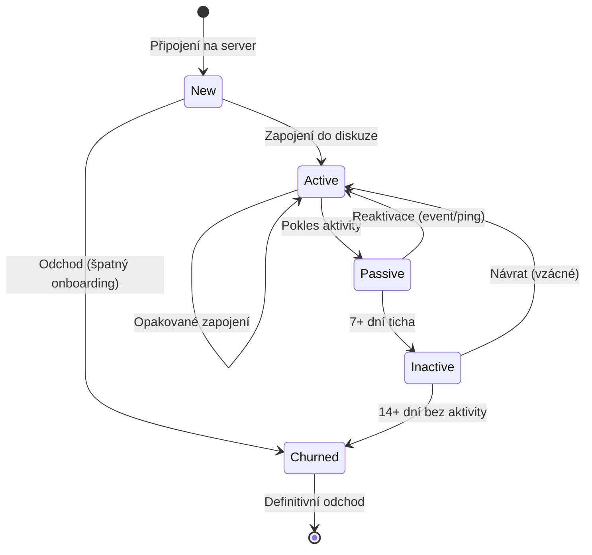

# Průvodce pro moderátory

Tato příručka vám pomůže interpretovat nasbíraná data, pracovat s predikcemi a efektivně řešit krizové stavy na serveru.

## Sledování životního cyklu uživatele

Každý člen komunity se nachází v jednom z pěti stavů. Metricord tyto stavy monitoruje a pomocí Markovových řetězců předpovídá, zda uživatel na serveru zůstane, nebo odejde.

### Interpretujte stavy uživatelů

| Stav | Co znamená | Vaše doporučená akce |
| :--- | :--- | :--- |
| **New** | Uživatel se připojil před méně než 24 hodinami. | Přivítejte nováčka. Tato fáze rozhoduje o jeho setrvání. |
| **Active** | Pravidelně přispívá v posledních 7 dnech. | Udržujte zapojení: odpovídejte na dotazy a tvořte nová témata. |
| **Passive** | Aktivita v posledních 3–7 dnech výrazně klesla. | „Lurkers" - zkuste je označit v relevantní diskuzi. |
| **Inactive** | Žádná aktivita za posledních 7–14 dní. | Kritická zóna. Zvažte osobní pozvánku na blížící se event. |
| **Churned** | Uživatel odešel nebo je inaktivní déle než 14 dní. | Analyzujte příčinu odchodu pro budoucí zlepšení. |

## Práce s metrikami dashboardu

### Engagement Score (0–100)
Tato hodnota vám říká, jak „zdravý" je váš server jako celek.

| Skóre | Význam | Co byste měli udělat? |
| :--- | :--- | :--- |
| **0–30** | Kritický stav | Uspořádejte okamžitý event nebo AMA pro oživení diskuze. |
| **30–50** | Slabá aktivita | Komunita stagnuje. Plánujte akce na časy nejvyšší špičky. |
| **50–80** | Optimální stav | Zdravá komunita. Pokračujte v nastavené strategii. |
| **80–100** | Hyperaktivita | Sledujte kvalitu diskuze a posilte dozor proti spamu. |

### Stickiness a MII index
- **Stickiness (`DAU / MAU`):** Cílem je hodnota nad 20 %. Pokud klesne pod 5 %, uživatelé se na server nevracejí.
- **MII (Moderator Intervention Index):** Sleduje úroveň toxicity. Pokud MII roste při stabilní aktivitě, musíte zpřísnit pravidla nebo filtr slov.

## Řešení krizových scénářů

> [!IMPORTANT]
> Prediktivní modely (Markov, Kaplan-Meier) slouží k včasnému varování. Nečekejte, až uživatelé odejdou - jednejte ve chvíli, kdy data ukazují riziko.

### Scénář: Náhlý propad denní aktivity (DAU)
Pokud zaznamenáte pokles o více než 30 % za 24 hodin, prověřte `activity stats` nejaktivnějších členů. Možná došlo ke konfliktu, který vyústil v jejich odchod do soukromých zpráv nebo na jiný server.

### Scénář: Vysoká toxicita (Rostoucí MII)
Pokud MII překročí hodnotu 0,05, zkontrolujte Heatmapu aktivity. Zjistěte, ve které hodiny k incidentům dochází, a v tyto časy posilte moderátorské směny.

### Scénář: Selhání onboardingu nových členů
Pokud Kaplan-Meierova křivka přežití ukazuje strmý pád (více než 60 % odchodů) během prvních 48 hodin, upravte uvítací kanál nebo zjednodušte proces výběru rolí.

## Praktické tipy pro moderaci

- **Využívejte Heatmapu:** Plánujte důležitá oznámení na časy, kdy je na serveru statisticky nejvíce lidí.
- **Sledujte Reply Ratio:** Pokud je nízké, komunita spolu nemluví. Iniciujte dialog pokládáním otevřených otázek.
- **Zkontrolujte `sync_names`:** Pokud vidíte v dashboardu neaktuální přezdívky, proveďte synchronizaci příkazem `/activity sync_names`.
