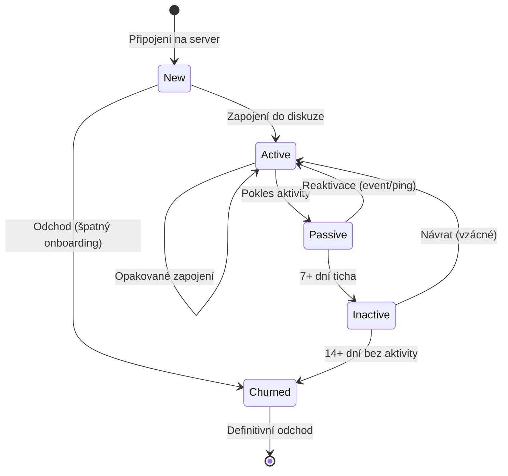

# Průvodce pro moderátory (Produkční edice)

Kompletní příručka pro moderátorský tým. Pokrývá interpretaci metrik, práci s prediktivními modely, krizové scénáře a provozní postupy pro každodenní správu komunity.

::: info Filozofie Metricord: Data-Driven Moderace
Metricord vám umožňuje **proaktivní moderaci** — identifikaci problémů dříve, než se stanou kritickými. Cílem je přejít od „hašení požárů" k systematickému řízení zdraví komunity.
:::

## 1. Životní cyklus uživatele

Každý člen komunity prochází pěti stavy. Metricord sleduje přechody mezi nimi a predikuje budoucí vývoj pomocí Markovových řetězců.

| Stav | Definice | Vaše akce jako moderátora |
| :--- | :--- | :--- |
| **New** | Prvních 24 hodin od připojení. | Přivítejte uživatele. Kritická fáze onboardingu. |
| **Active** | Pravidelná aktivita v posledních 7 dnech. | Udržujte zapojení: odpovídejte na zprávy, tvořte témata. |
| **Passive** | Nízká aktivita v posledních 3–7 dnech. | „Lurkers" — potřebují postrčit. Zmiňte je v diskuzi. |
| **Inactive** | Žádná aktivita 7–14 dní. | Hazardní zóna. Zvažte osobní zprávu s pozvánkou. |
| **Churned** | Opustil server nebo inaktivní > 14 dní. | Analýza příčiny pro budoucí zlepšení. |

## 2. Metriky dashboardu

### Engagement Score (0–100)
Kompozitní index zdraví serveru. Váhy: 25% Moderace + 25% Bezpečnost + 25% Zapojení + 25% Aktivita týmu.

| Rozsah | Stav | Doporučená akce |
| :--- | :--- | :--- |
| **0–30** | 🔴 Kritický | Server je v „klinické smrti". Iniciujte eventy. |
| **30–50** | 🟡 Slabý | Komunita stagnuje. Plánujte akce na silné hodiny. |
| **50–80** | 🟢 Zdravý | Optimální zóna. Udržujte stávající strategii. |
| **80–100** | 🟣 Hyperaktivní | Pozor na spam a toxicitu. Posilte moderaci. |

### Stickiness (Lepivost)
Vzorec: `(DAU / MAU) × 100`. Kolik procent měsíčních uživatelů se vrací **každý den**.
- **> 20%** = velmi aktivní komunita.
- **< 5%** = „přízrakový server".

### MII (Moderator Intervention Index)
Index úrovně toxicity. Vážený poměr moderátorských akcí k objemu zpráv.

| MII | Engagement | Interpretace |
| :--- | :--- | :--- |
| Nízký | Nízký | Komunita je „mrtvá". |
| Nízký | Vysoký | **Ideální stav.** Živá komunita bez konfliktů. |
| Vysoký | Vysoký | Živá, ale konfliktní. Posilte pravidla. |
| Vysoký | Nízký | Toxické prostředí odrazuje nové členy. |

## 3. Prediktivní modely v praxi

### Markovovy řetězce (Retence)
- **Co sledovat:** Pokud model očekává odchod > 15% členů do 3 dnů.
- **Akce:** Targetujte uživatele v `Passive` a `Inactive` stavu.

### Kaplan-Meier (Survival analýza)
- **Co sledovat:** Prudký pád křivky po N dnech.
- **Příklad:** Pád po 3 dnech = špatný onboarding. Vylepšete uvítací proces.

## 4. Krizové scénáře

::: info Scénář: Náhlý úbytek DAU
- **Symptomy:** DAU klesne o 30%+ za 24h.
- **Řešení:** Zkontrolujte `activity stats` top členů. Uspořádejte AMA.
:::

::: danger Scénář: Vysoký MII (Toxicita)
- **Symptomy:** MII > 0.05, rostoucí počet reportů.
- **Řešení:** Zkontrolujte Heatmapu aktivity. Posilte směnu v krizový čas.
:::

::: warning Scénář: Špatný onboarding
- **Symptomy:** Survival křivka ukazuje 60%+ odchod do 48h.
- **Řešení:** Vytvořte přehledný welcome kanál, nastavte role-selector.
:::

## 5. XP systém a gamifikace

- **Cooldown:** 60 sekund mezi XP zprávami.
- **Délka:** Krátká (1 XP), Standardní (5 XP), Dlouhá (15+ XP).
- **Reply bonus:** +10 XP za odpověď na zprávu jiného uživatele.
- **Voice:** 5 XP / min aktivního mikrofonu (AFK = 0 XP).
- **Leveling křivka:** `XP(L) = 50 × L² + 200 × L + 100`.

## 6. FAQ pro moderátory

::: details Proč bot nepočítá zprávy v některých kanálech?
Bot ignoruje kanály bez práva `View Channel` nebo ty na Blacklistu (např. Staff sekce).
:::

::: details Může bot odhalit alternativní účty (Alty)?
Ano, v sekci Security porovnává join-time a vzorce chování. Při shodě hlásí „Potential Alt".
:::

::: details Vidí uživatelé mé predikce?
Ne. Rozhraní je dostupné pouze pro role s `Manage Server` nebo `Administrator`.
:::
