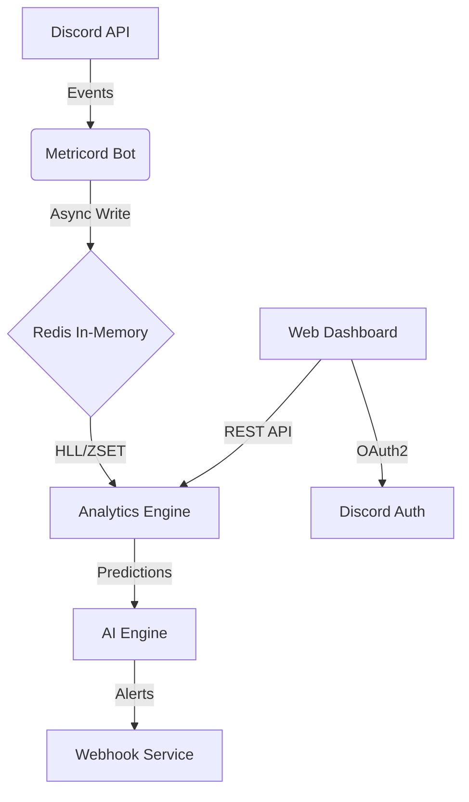

# Instalace a nastavení

Přidání bota na váš server je jednoduchý proces, který nezabere více než pár minut.

## 1. Pozvání bota

Přejděte na domovskou stránku a klikněte na tlačítko **"Přidat na Discord"**. Budete přesměrováni na oficiální Discord autorizaci.

::: info Požadovaná oprávnění
- `View Channels` & `Read Messages` - Analýza aktivity v chatu.
- `Read Message History` - Historická analýza a backfill dat.
- `Connect` & `Speak` - Sledování účasti ve voice kanálech.
- `Manage Roles` (Volitelné) - Pro automatizaci rolí za aktivitu.
:::

## 2. Konfigurace Dashboardu

Po přihlášení do dashboardu uvidíte seznam serverů, kde máte práva správce. Vyberte server, který chcete spravovat.

### Nastavení vah aktivit

V sekci **Nastavení** můžete definovat, jakou váhu má zpráva oproti minutě ve voice kanálu.

> **Doporučené nastavení:**
> - Zpráva: 1 bod
> - Minuta ve voice: 2 body

## Vnitřní tok dat

### Přístup pro moderátory

Ve výchozím nastavení má přístup pouze majitel serveru. V sekci **Tým** můžete přidat role (např. @Moderator), které budou mít přístup k prohlížení statistik v dashboardu.

## 3. Nastavení E-mailu (OTP)

Pro přihlašování pomocí e-mailu je nutné v souboru `config/dashboard_secrets.py` nastavit SMTP server.

::: warning Důležité hodnoty
- `SMTP_HOST` - Adresa vašeho SMTP serveru.
- `SMTP_PORT` - Port (obvykle 587 pro TLS).
- `SMTP_USER` - Uživatelské jméno / E-mail.
- `SMTP_PASSWORD` - Heslo (pro Gmail použijte "App Password").
:::

Pokud nejsou tyto údaje vyplněny, bot běží v **Dev Módu** a přihlašovací kódy vypisuje pouze do konzole serveru.
