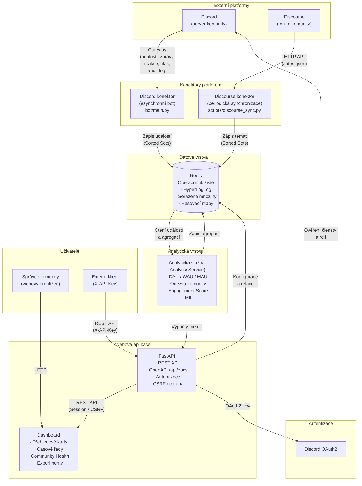

# Architektura systému

CommunityMetrics je distribuovaný systém navržený pro zpracování událostí z komunitních platforem v reálném čase. Tato stránka podrobně popisuje všechny komponenty, jejich komunikaci a datový tok.

## 1. High-level přehled



## 2. Technický stack

| Komponenta | Technologie | Verze | Účel |
| :--- | :--- | :--- | :--- |
| **Bot Engine** | Python, discord.py | 3.11, 2.6.4 | Asynchronní zpracování Discord událostí, command handling |
| **Discourse Sync** | Python, httpx | 3.11, 0.27.2 | Periodická synchronizace témat z Discourse fóra |
| **Dashboard Backend** | FastAPI, Uvicorn | 0.121.1, 0.35.0 | REST API, server-side rendering, OAuth2 |
| **Dashboard Frontend** | Jinja2, Chart.js | 3.1.6, – | Serverově renderované HTML šablony, interaktivní grafy |
| **Datové úložiště** | Redis | alpine (Docker) | In-memory databáze pro real-time analytiku |
| **Matematické modely** | NumPy | 2.3.2 | Markovovy řetězce, Kaplan-Meier, lineární regrese |
| **Autentizace** | Discord OAuth2, itsdangerous | –, 2.2.0 | Session cookies, CSRF ochrana |
| **Validace** | Pydantic, pydantic-settings | 2.12.4, 2.8.0 | Validace dat a konfigurace prostředí |
| **Kontejnerizace** | Docker, Docker Compose | python:3.11-slim | Izolace služeb, produkční nasazení |
| **Dokumentace** | VitePress | ^1.0.0 | Moderní dokumentace s MathJax a Mermaid |

## 3. Adresářová struktura projektu

```text
communitymetrics/
 bot/
    main.py              # Entry point, event loop, background tasks
    commands/
        activity.py      # Hlavní tracking modul — XP, voice, zprávy
        stats_hll.py     # HyperLogLog statistiky — DAU/MAU
        gdpr.py          # GDPR příkazy — export, smazání dat
        health.py        # Zdravotní check — Redis ping, bot status
        help.py          # Interaktivní nápověda
        ping.py          # Měření latence k Discord API
        community_health.py    # Community Health příkazy
        analytics_tracking.py  # Event tracking pro dashboard
 web/
    backend/
       main.py           # FastAPI app — middleware, routery, error handling
       security.py       # CSRF ochrana (require_csrf)
       utils.py          # Analytické výpočty — Engagement, predikce
       hydrate_users.py  # Synchronizace uživatelských dat
       routers/
           auth.py       # Discord OAuth2, demo login
           pages.py      # Server-side rendered HTML stránky
           api.py        # REST API endpointy (JSON)
           settings.py   # Konfigurace dashboardu
           community_health.py  # Community Health stránky
       services/
           analytics_service.py       # AnalyticsService — metriky
           community_health_service.py # CommunityHealthService
       repositories/
           redis_repo.py  # Repository pattern pro Redis
    frontend/
       templates/         # Jinja2 HTML šablony (22 souborů)
       static/            # CSS, JS, obrázky
 shared/
    keys.py              # Redis klíčová schéma (centrální definice)
    models.py            # Matematické modely — Markov, Kaplan-Meier
    redis_client.py      # Redis connection pool (async + sync)
    config.py            # Pydantic Settings — prostředí, retence
    community_health.py  # Helper funkce pro Community Health
    analytics_config.py  # Výchozí váhy MII
 scripts/
    discourse_sync.py    # Konektor pro Discourse fórum
 config/                  # Konfigurace a tajemství
 docker-compose.yml       # Produkční nasazení (5 kontejnerů)
 Dockerfile               # Container image (python:3.11-slim)
 start.sh                 # Lokální spouštěč
 requirements.txt         # Python závislosti
 .env.example             # Šablona konfigurace
```

## 4. Detailní datový tok (Event-Driven Flow)

CommunityMetrics využívá plně asynchronní architekturu postavenou na `asyncio`.

::: info A. Ingesce (Bot Layer)
Discord Gateway pošle JSON událost (např. `MESSAGE_CREATE`). Bot ji dekóduje a okamžitě předává do `ActivityTracker`. Zde se provádí *Deduplikace* (zabránění započítání stejné zprávy dvakrát).
:::

::: info B. Zpracování & Skórování
Vypočítá se základní XP. Pokud zpráva obsahuje více než 50 znaků, aplikuje se `Length-Based Bonus`. Pokud uživatel napsal zprávu před méně než 60 sekundami (konfigurovatelné), body se nepřičtou (Cooldown), ale událost se započítá do DAU/MAU statistik.
:::

::: info C. Persistence (Redis Pipeline)
Pro minimalizaci latence bot používá Redis Pipeline:
```text
PIPELINE:
  PFADD hll:dau:{gid}:{date} {uid}
  HINCRBY stats:hourly:{gid}:{date} {hour} 1
  ZADD events:msg:{gid}:{uid} {now} {json_metadata}
```
:::

::: info D. Discourse synchronizace
Discourse konektor (`scripts/discourse_sync.py`) každých 300 sekund dotazuje Discourse API (`/latest.json`), idempotně ukládá nová témata do Redis Sorted Setů a automaticky aplikuje retenci dle `EVENT_RETENTION_DAYS`.
:::

## 5. Redis Schéma — Deep Dive

CommunityMetrics využívá pokročilé datové struktury Redis pro maximální efektivitu.

**HyperLogLog (HLL):**
Umožňuje sledovat unikátní uživatele (DAU/MAU) s fixní paměťovou náročností 12 KB bez ohledu na počet členů (i miliony). Chyba odhadu je pouze 0.81%.

| Struktura | Klíč (Shared Keys) | Použití |
| :--- | :--- | :--- |
| **HyperLogLog** | `hll:dau:{gid}:{YYYYMMDD}` | Unikátní denní aktivní uživatelé (12 KB fixní). |
| **Sorted Set (ZSET)** | `events:msg:{gid}:{uid}` | Score = Timestamp. Metadata zpráv. |
| **Sorted Set (ZSET)** | `events:voice:{gid}:{uid}` | Voice sezení (hodnota = délka v sekundách). |
| **Sorted Set (ZSET)** | `events:action:{gid}:{uid}` | Moderátorské akce (typ, timestamp). |
| **Hash (HASH)** | `stats:hourly:{gid}:{YYYYMMDD}` | Počty zpráv po hodinách (klíče "0"–"23"). |
| **Hash (HASH)** | `stats:heatmap:{gid}` | Matice aktivity (klíč "den:hodina"). |
| **Hash (HASH)** | `stats:msglen:{gid}` | Distribuce délek zpráv do bucketů. |
| **Hash (HASH)** | `discourse:conf:{gid}` | Konfigurace Discourse (url, api_key, api_user). |
| **String** | `bot:heartbeat` (TTL 60s) | Timestamp posledního cyklu bota. |
| **Set (SET)** | `bot:guilds` | Globální seznam aktivních serverů. |
| **String** | `presence:online:{gid}` (TTL 300s) | Počet online členů. |

### Retence dat

| Kategorie | Retence | Zdroj |
| :--- | :--- | :--- |
| Surové eventy | Konfigurovatelné (výchozí **90 dní**, `EVENT_RETENTION_DAYS`) | `shared/config.py` |
| HLL statistiky | **90 dní** | Přetrvávají nezávisle na eventech |
| Uživatelská cache | **7 dní** | TTL na `user:info:{uid}` |
| Runtime status | **60–300 s** | TTL na `bot:heartbeat`, `presence:*` |

## 6. Background Workers & Kontejnery

Projekt je rozdělen do 5 izolovaných kontejnerů v Docker síti `botnet`:

| Kontejner | Obraz | Příkaz | Port | Funkce |
| :--- | :--- | :--- | :--- | :--- |
| `discord-redis` | `redis:alpine` | výchozí Redis | interní | In-memory databáze |
| `discord-bot-primary` | `python:3.11-slim` | `python bot/main.py` | — | Sběr událostí z Discord Gateway, příkazy |
| `discord-bot-dashboard` | `python:3.11-slim` | `python bot/main.py` (LITE) | — | Záložní sběr dat bez slash příkazů |
| `web-dashboard` | `python:3.11-slim` | `uvicorn web.backend.main:app` | **8093** | FastAPI backend s OAuth2 a REST API |
| `discourse-sync` | `python:3.11-slim` | `python -m scripts.discourse_sync` | — | Periodická synchronizace Discourse fóra |

::: tip Optimalizace výkonu
Náročné maticové operace pro Markovovy řetězce jsou prováděny pomocí `NumPy` v C-extension, což je o 2 řády rychlejší než čistý Python.
:::

## 7. Životní cyklus události (Pipeline Step-by-Step)

Každá zpráva na Discordu projde následujícím řetězcem zpracování:

1.  **Ingesce:** Gateway WebSocket bota přijme událost `MESSAGE_CREATE`.
2.  **Validace:** Bot ověří, zda zpráva nepochází od jiného bota a zda má CommunityMetrics přístup k obsahu zprávy (Message Intent).
3.  **Extrakce metadat:** Získá se `user_id`, `guild_id`, timestamp a délka zprávy.
4.  **Asynchronní zápis:** Bot odešle data do Redis pipeline. Akce nezamyká hlavní vlákno bota, což zajišťuje plynulý chod.
5.  **HyperLogLog Sync:** ID uživatele se započítá do denní HLL struktury pro sledování DAU.
6.  **Výpočet XP:** Bot vypočítá XP na základě délky zprávy a cooldownu. Pokud je vše v pořádku, inkrementuje XP v Redis Hashi daného uživatele.
7.  **Zobrazení:** Dashboard při dalším načtení vytáhne čerstvá data z Redisu, provede transformaci pomocí NumPy a vykreslí aktualizované grafy.

## 8. Nginx jako reverzní proxy

V produkčním prostředí běží FastAPI backend za proxy serverem Nginx. Nginx zajišťuje:
- **SSL Termination:** Šifrování HTTPS komunikace směrem k uživateli.
- **VitePress Caching:** Rychlé servírování statické dokumentace bez zatěžování backendu.

Vzorová konfigurace je k dispozici v souboru `config/nginx-reverse-proxy.conf`.
