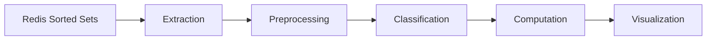

# ML pipeline

Popis prototypového prediktivního systému CommunityMetrics – od sběru dat po vizualizaci experimentálních výsledků. Tyto funkce představují budoucí možnosti analýzy a nejsou určeny pro produkční rozhodování o uživatelích.

::: warning Prototypové odhady
Všechny predikce vycházejí z historických dat. Nepředvídatelné události (raid, zmínka influencera, sezónní výkyvy) mohou realitu výrazně změnit. Modely slouží jako analytický experiment.
:::

## Architektura prototypu

Tento experimentální systém zpracovává data v 5 fázích:



### Fáze 1: Extraction (načtení dat)

FastAPI backend vytáhne pro daný server řadu Sorted Setů z Redis:
- `events:msg:{guild_id}:{user_id}` - metadata zpráv.
- `events:voice:{guild_id}:{user_id}` - voice sessions.
- `events:action:{guild_id}:{user_id}` - moderátorské akce.

Výchozí časové okno je 30 dní. Pro každý klíč se volá `ZRANGEBYSCORE` s parametry `min` a `max` jako UNIX timestampy.

```python
# Příklad: načtení zpráv za posledních 30 dní
messages = await redis.zrangebyscore(
    f"events:msg:{guild_id}:{user_id}",
    min=now - 30*86400,
    max=now
)
```

### Fáze 2: Preprocessing (vektorizace)

Surové UNIX timestampy se převedou na diskrétní časové řady pomocí NumPy. Výsledkem je matice o rozměru (Uživatelé × Dny), kde každá buňka obsahuje agregovanou metriku aktivity.

Pro každého uživatele a každý den se vypočítá:
- Počet zpráv.
- Celková délka zpráv (v znacích).
- Voice minuty.
- Počet moderátorských akcí.

Tyto hodnoty se vynásobí konfiguratelnými váhami (viz `config:action_weights` v Redis) a sečtou do jedné hodnoty - **váženého skóre aktivity**.

### Fáze 3: Classification (přiřazení stavů)

Každému uživateli se přiřadí jeden z 4 diskrétních stavů na základě jeho aktivity za posledních 30 dní. Klasifikace probíhá pro každý den v historii zvlášť, což umožňuje sestavit historii přechodů pro Markovův model.

| Stav | Označení | Technické kritérium | Význam pro komunitu |
| :--- | :--- | :--- | :--- |
| **New** | $S_0$ | Join date < 24h | Nováčci v procesu onboardingu. |
| **Active** | $S_1$ | Aktivita v $[T-2, T]$ | Jádro komunity, které se pravidelně zapojuje. |
| **Passive** | $S_2$ | Aktivita v $[T-7, T-3]$ | Uživatelé, u kterých dochází k poklesu zájmu. |
| **Inactive** | $S_3$ | Aktivita > 7 dní zpět | Kritická fáze dlouhodobé neaktivity. |

### Fáze 4: Computation (výpočet)

V této fázi se volají metody z `shared/models.py`:

#### Matice přechodu (Markov)

Systém spočítá přechodovou matici $P$ z pozorovaných přechodů za posledních 30 dní. Pro každou dvojici stavů $(i, j)$ se spočítá, kolikrát uživatel přešel ze stavu $i$ do stavu $j$, a výsledek se normalizuje:

$$P_{ij} = \frac{\text{počet přechodů } i \to j}{\text{celkový počet přechodů z } i}$$

Pokud pro stav $i$ neexistují žádná pozorování, model předpokládá setrvání ve stavu: $P_{ii} = 1$.

Implementace v `shared/models.py`:

```python
@staticmethod
def calculate_markov_matrix(transitions, num_states=5):
    matrix = np.zeros((num_states, num_states))
    for start, end in transitions:
        matrix[start][end] += 1
    # Normalizace řádků
    for i in range(num_states):
        row_sum = np.sum(matrix[i])
        if row_sum > 0:
            matrix[i] = matrix[i] / row_sum
        else:
            matrix[i] = np.zeros(num_states) # Zůstává 0, pokud nepozorováno
    return matrix
```

#### Predikce rozložení

Aktuální rozložení komunity (vektor $\mathbf{v}_0$) se vynásobí maticí $P^n$ pro predikci stavu po $n$ dnech:

$$\mathbf{v}_n = \mathbf{v}_0 \cdot P^n$$

Příklad: pokud aktuální rozložení je $\mathbf{v}_0 = [0{,}05,\ 0{,}40,\ 0{,}30,\ 0{,}25]$, model po 7 dnech odhadne nové teoretické rozložení uživatelů ve stavech New, Active, Passive a Inactive.

#### Kaplan-Meier (Survival)

Pro odhad doby setrvání v aktivitě se z historických dat vytvoří dva vektory:
- `durations` - počet dní od připojení do poslední pozorované aktivity.
- `event_observed` - `True` pokud aktivita ustala (neaktivita přesáhla práh), `False` pokud je uživatel stále aktivní (cenzorovaná data).

```python
@staticmethod
def calculate_survival_rate(durations, event_observed):
    # Kaplan-Meier estimátor
    for t in unique_times:
        n_events = sum((d == t) & e)
        s_t *= (1 - n_events / n_at_risk)
        survival_curve[t] = s_t
        n_at_risk -= (n_events + n_censored)
    return survival_curve
```

Výstupem je křivka přežití - monotónně klesající funkce $\hat{S}(t)$, která udává pravděpodobnost, že uživatel zůstane aktivní alespoň $t$ dní.

#### Medián doby setrvání v aktivitě

Z křivky přežití se stanovuje medián, tedy čas $t$, kdy křivka klesne na hodnotu 0,5 (50 %):

$$ \text{Medián} = \min \{ t \mid \hat{S}(t) \le 0,5 \} $$

### Fáze 5: Visualization (vizualizace)

Výsledky se vrátí jako JSON struktura, kterou Chart.js na dashboardu vykreslí:

- **Survival Curve** - čárový graf $\hat{S}(t)$ vs. $t$ (dny).
- **State Distribution** - sloupcový graf rozložení komunity ve stavech $S_0$ až $S_3$ (aktuální vs. modelované).
- **Growth Forecast** - kombinovaný graf s lineární predikcí a sezónními indexy.

## Odhad růstu členů

Prototyp odhaduje možný budoucí počet členů v horizontu 30, 60 a 90 dní. Toto není produkční predikce, nýbrž explorativní datový pohled.

### Metodika

1. Výpočet čistého přírůstku (Joins − Leaves) za posledních 12 měsíců.
2. Klouzavý průměr za 30 dní pro vyhlazení denních výkyvů.
3. Lineární projekce trendu do budoucna.

### Sezónní korekce (Weekly Seasonality)

Aktivita na Discordu vykazuje silné týdenní vzorce. Aby CommunityMetrics předešel falešně pozitivním trendům (např. nárůst aktivity v pátek), aplikujeme sezónní indexy $I_d$ vypočítané jako:

$$
I_d = \frac{\text{Průměrná aktivita v den } d}{\text{Celková průměrná denní aktivita}}
$$

| Den | Typický index $I_d$ | Interpretace |
| :--- | :--- | :--- |
| **Pondělí–Čtvrtek** | 0,85–0,95 | Pracovní týden, nižší intenzita zpráv. |
| **Pátek** | 1,15–1,25 | Začátek víkendu, nárůst večerní aktivity. |
| **Sobota–Neděle** | 1,20–1,40 | Špička aktivity, nejlepší čas pro komunitní eventy. |

Lineární predikce růstu se násobí příslušným sezónním indexem pro daný budoucí den, čímž získáte realističtější předpověď.

## Prototyp analýzy stability aktivity (Inactivity Risk Analysis)

Widget „Predikce stability" na dashboardu experimentálně zobrazuje:

- **Odhadovaná míra neaktivity (Inactivity Rate)** - poměr uživatelů, kteří ztratili aktivitu, k celkové velikosti komunity za měsíc.
- **At-Risk Users** - počet uživatelů ve stavu Passive nebo Inactive.
- **Odhadovaný vývoj (7 dní)** - modelový odhad budoucí míry odchodů na základě Markovova řetězce.

Pokud odchody přesáhnou 5 % celkového počtu členů za měsíc, systém vygeneruje Smart Insight s varováním.

## Omezení modelů

| Omezení | Popis | Důsledek |
| :--- | :--- | :--- |
| Markovova vlastnost | Budoucí stav závisí pouze na současném stavu. | Dlouhodobé závislosti (sezónnost, životní události) nejsou zachyceny. |
| Minimum dat | Model vyžaduje alespoň 7 dní historie. | Na nových serverech jsou predikce nedostupné (DQS < 0,5). |
| Homogenita populace | Model předpokládá stejné pravděpodobnosti přechodu pro všechny uživatele. | Klíčoví členové a nováčci mají ve skutečnosti odlišné vzorce. |
| Absence sentimentu | Systém nehodnotí tón konverzace. | Toxicita je měřena nepřímo přes moderátorské zásahy (MII). |
